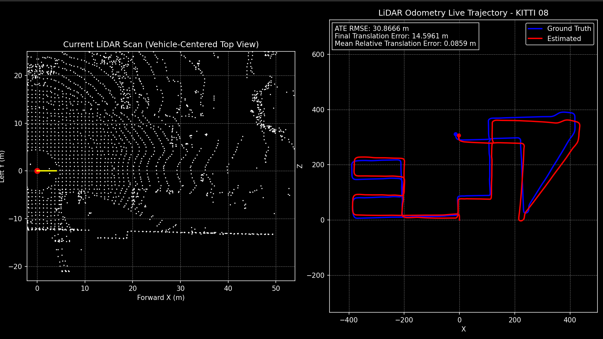

# LiDAR Odometry

<p align="center">
  
</p>

## Overview
This project implements a **LiDAR-only Odometry pipeline** using classical geometric registration techniques. The system estimates sensor motion by aligning consecutive 3D point clouds from the KITTI dataset.

The pipeline is designed to be modular, interpretable, and efficient, making it suitable for both **research experimentation** and **robotics perception understanding**.

## Features
- LiDAR point cloud preprocessing (range + height filtering)
- Voxel downsampling for efficient computation
- Point-to-plane ICP registration
- Frame-to-frame motion estimation
- Incremental trajectory reconstruction
- Real-time visualization:
  - Vehicle-centric LiDAR scan
  - Global trajectory (Ground Truth vs Estimated)
- Interactive scan view (pan, zoom, reset)
- End-of-run evaluation metrics

## Pipeline Overview
1. Load LiDAR scans from dataset  
2. Apply filtering (range + height constraints)  
3. Downsample using voxel grid  
4. Perform ICP between consecutive frames  
5. Estimate relative transformation  
6. Accumulate pose over time  
7. Update trajectory visualization  

## Visualization
- Current LiDAR scan in vehicle frame  
- Interactive controls:
  - Drag to pan  
  - Scroll to zoom  
  - Press `r` to reset view  
- Trajectory comparison:
  - Ground Truth shown in blue  
  - Estimated trajectory shown in red  
- Final metrics displayed on trajectory plot  

## Metrics
At the end of each run, the following metrics are computed:
- **ATE RMSE** – overall trajectory error  
- **Final Translation Error** – drift at final frame  
- **Mean Relative Translation Error** – frame-to-frame motion error  

These are printed in the terminal and displayed in the visualization.

## Key Concepts
- Iterative Closest Point (ICP)  
- Point-to-plane registration  
- 3D rigid body transformations  
- Coordinate frame conversions (LiDAR ↔ Camera)  
- Trajectory accumulation  

## How to Run
```bash
python main.py \
  --sequence <sequence_id> \
  --dataset_root <path_to_kitti_sequences> \
  --calib_root <path_to_calibration> \
  --gt_root <path_to_ground_truth>